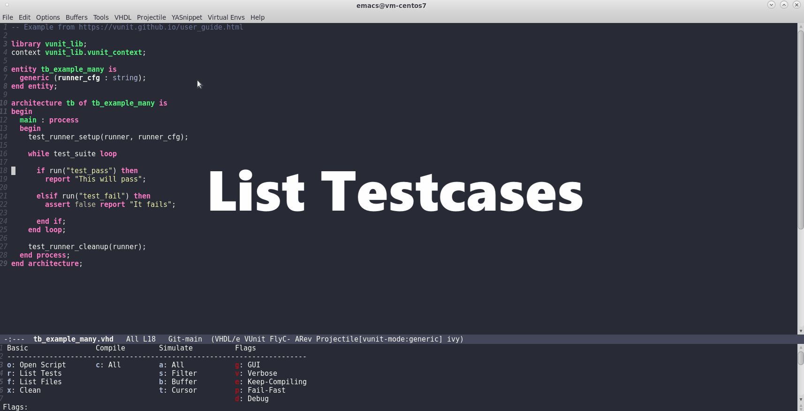

# VUnit Mode [![check][check-badge]][check-link] [![melpa badge][melpa-badge]][melpa-link]

This is a package for GNU Emacs that can be used to interface with
[VUnit](https://vunit.github.io/) which is an open-source testing
framework for VHDL/SystemVerilog.

It hooks to the VHDL mode and wraps the function calls to
the run script used by VUnit, therefore allows verification of unit
tests while writing code without ever leaving Emacs.
At the moment, it is in a very early stage of development where it
simply makes use of the compile package and hydra, but in the near
future and with some support from the community, the idea is to
implement something similar to Magit for VUnit.



## Prerequisites

The basic requirements are that the HDL simulator 
(eg. [Modelsim](https://eda.sw.siemens.com/en-US/ic/modelsim/))
is in the path and that VUnit is installed in the python environment.

## Installation

### MELPA

The preferred installation method is through [MELPA](https://melpa.org/).

Add MELPA in your `~/.emacs` or `~/.emacs.d/init.el` init file.

```elisp
(add-to-list 'package-archives '("melpa" . "https://melpa.org/packages/"))
```

Then install the package

```elisp
M-x package-refresh-contents RET
M-x package-install RET vunit-mode RET
```

Finally enable the mode in your init file.

```elisp
(require 'vunit-mode)
(global-vunit-mode t)
```

### Manual

To manually install the package, clone this repository and add the
following in your `~/.emacs` or `~/.emacs.d/init.el` init file.

```elisp
(add-to-list 'load-path "/path-to-repository/")
(require 'vunit-mode)
(global-vunit-mode t)
```

## Usage

### Keybinding

The default keybinding to invoke vunit-mode is `C-x x`.

Keys highlighted in blue will execute the specified action and
quit the vunit-mode command window.
The ones marked in red, however, will add additional flags
to the actions available in blue.

### Menu Bar

Once a VHDL file is loaded in the buffer, the `VUnit` Menu will
appear in the Menu Bar. It is also possible to set flags and run
tests without having to know any key bindings at all.

## Configuration

As for now, it is possible to configure the following variables
using `M-x Customize`:

Path to the VUnit directory.
> vunit-path

The Python executable used by VUnit.
> vunit-python-executable

Name of the VUnit output directory.
> vunit-run-outdir

Name of the python script to run.
> vunit-run-script

Number of threads to use in parallel.
> vunit-num-threads

Auto-scroll to bottom in the compile buffer.
> vunit-auto-scroll

## Contributing

Since this is my first application ever written in Emacs Lisp
support and input from advanced developers is highly appreciated.

To report bugs and suggest new features please use the
[issue tracker](https://github.com/embed-me/vunit-mode/issues).
In order to merge some code, please open a
[pull request](https://github.com/embed-me/vunit-mode/pulls).

## Acknowledgments

The idea for a VUnit Emacs mode seemed to be around for a while and was
already discussed online a couple of years ago, however,
for me, Markus Pfaff from FH-Hagenberg was the one who inspired me to
take the implementation into my own hands and despite my lack of knowledge
in elisp publish the code written so far.


[check-link]: https://github.com/embed-me/vunit-mode/actions
[check-badge]: https://github.com/embed-me/vunit-mode/actions/workflows/github-actions-ci.yml/badge.svg
[melpa-link]: https://melpa.org/#/vunit-mode
[melpa-badge]: https://melpa.org/packages/vunit-mode-badge.svg